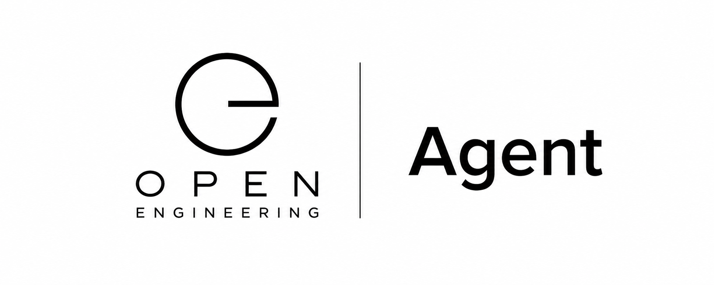

# Open Engineering Agent

The agent layer for Open Engineering.



Open Engineering Agent provides the intelligent workers that investigate, reason, plan, execute, verify, and communicate across the Open Engineering ecosystem.

An Open Engineering Agent is more than a chatbot and more than an autonomous coding assistant. It is an engineering actor: an identifiable, composable software element that can operate on engineering objects, use capabilities, collaborate with other agents, and produce evidence-backed outcomes.

⸻

## The idea

Modern engineering increasingly involves agents.

Agents can inspect repositories, understand architectures, investigate problems, create implementation plans, write software, operate infrastructure, analyze systems, produce documentation, and coordinate with other agents.

But an agent becomes significantly more useful when it is part of an engineering system rather than an isolated prompt.

Open Engineering Agent provides that layer.
```
                         Open Engineering
                                │
                                ▼
                       ┌─────────────────┐
                       │      Agent      │
                       │                 │
                       │ Observe         │
                       │ Investigate     │
                       │ Reason          │
                       │ Plan            │
                       │ Execute         │
                       │ Verify          │
                       │ Report          │
                       └────────┬────────┘
                                │
             ┌──────────────────┼──────────────────┐
             ▼                  ▼                  ▼
          Humans            Systems            Agents
             │                  │                  │
             └──────────────────┼──────────────────┘
                                ▼
                       Engineering Outcome
```
The objective is not to create one universal agent.

The objective is to create an open ecosystem of specialized engineering agents that can work together.

⸻

## What is an Open Engineering Agent?

An Open Engineering Agent is an identifiable engineering actor with:

* Identity — it can be uniquely identified.
* Role — it has a defined engineering responsibility.
* Capabilities — it knows what it can do.
* Context — it can consume relevant engineering information.
* Memory — it can maintain useful continuity.
* Tools — it can interact with systems and the physical or digital world.
* Workflow — it can participate in engineering processes.
* Evidence — it can explain what it observed and did.
* Communication — it can collaborate with humans and other agents.
* Composition — it can become part of larger agent systems.

This makes an agent a reusable element rather than a disposable conversation.

⸻

Agent as an Engineering Element

Open Engineering uses an Element-Oriented Engineering approach.

The same principle applies to agents.

An agent can be treated as an engineering element:

Agent
 │
 ├── Identity
 ├── Definition
 ├── Role
 ├── Capabilities
 ├── Inputs
 ├── Outputs
 ├── Memory
 ├── Tools
 ├── Policies
 ├── Workflows
 ├── Evidence
 └── Relationships

Agents can therefore be discovered, composed, governed, visualized, and executed like other Open Engineering elements.

⸻

The Agent Lifecycle

Open Engineering Agents follow an engineering-oriented lifecycle.

       ┌───────────┐
       │  Observe  │
       └─────┬─────┘
             ▼
       ┌───────────┐
       │Investigate │
       └─────┬─────┘
             ▼
       ┌───────────┐
       │   Reason  │
       └─────┬─────┘
             ▼
       ┌───────────┐
       │    Plan   │
       └─────┬─────┘
             ▼
       ┌───────────┐
       │  Execute  │
       └─────┬─────┘
             ▼
       ┌───────────┐
       │  Verify   │
       └─────┬─────┘
             ▼
       ┌───────────┐
       │   Report  │
       └─────┬─────┘
             │
             └──────────────► Evidence

The important distinction is that execution is not the end of the process.

An engineering agent should be able to establish what happened, why it happened, what changed, and whether the intended outcome was achieved.

⸻

Agent Families

Open Engineering supports specialized agents rather than one monolithic intelligence.

Executive Agent

Coordinates engineering objectives and delegates work to other agents.

Product Agent

Connects product intent, requirements, journeys, capabilities, and engineering work.

Architect Agent

Reasons about architecture, boundaries, dependencies, and system evolution.

Engineering Agent

Implements engineering changes across source code, configuration, infrastructure, and related assets.

Detective Agent

Investigates engineering problems and produces evidence-backed findings.

Examples include:

* Code Smell Detective
* Repository Detective
* Architecture Detective
* Dependency Detective
* Cybersecurity Detective
* Documentation Detective
* Performance Detective
* Quality Detective
* Compliance Detective

Documentation Agent

Transforms engineering knowledge into durable documentation.

Release Agent

Coordinates validation, packaging, release preparation, and delivery.

Character Agent

Operates intelligent characters and other interactive elements.

⸻

Agents Work Together

The strength of Open Engineering Agent comes from composition.

A complex engineering mission might involve:

Executive Agent
       │
       ├── Product Agent
       │       └── Requirements
       │
       ├── Architect Agent
       │       └── Architecture
       │
       ├── Detective Agent
       │       └── Investigation
       │
       ├── Engineering Agent
       │       └── Implementation
       │
       ├── Documentation Agent
       │       └── Documentation
       │
       └── Release Agent
               └── Verification & Release

Each agent contributes a specialized capability while the overall mission remains coherent.

⸻

Agents and Capsules

Agents do not need to contain every capability themselves.

Open Engineering separates intelligence from reusable capabilities.

Capabilities can be packaged as Capsules.

Examples include:

* Character Capsule
* Systems Thinking Capsule
* Story Capsule
* Robotics Capsule
* Voice Capsule
* Vision Capsule
* Memory Capsule
* AI Capsule
* Identity Capsule
* Documentation Capsule
* Simulation Capsule

An agent can therefore acquire capabilities by composing Capsules.

                 Agent
                   │
       ┌───────────┼───────────┐
       ▼           ▼           ▼
    Memory       Vision    Documentation
    Capsule      Capsule      Capsule
       │           │           │
       └───────────┼───────────┘
                   ▼
             Agent Capability

This makes the agent architecture extensible without requiring every agent to become a new platform.

⸻

Agents and Operating Systems

Agents can operate through Open Engineering Operating Systems.

Examples include:

Detective OS

Provides the operating environment for engineering investigations.

Game OS

Provides execution and orchestration for games and agility-oriented experiences.

Runner OS

Provides time-based orchestration and scheduled execution.

Star OS

Provides the operating environment for intelligent characters and interactive entities.

The same agent model can therefore participate in very different engineering environments.

⸻

Agents and the Open Engineering Kernel

At the foundation sits the Open Engineering Kernel.

The Kernel provides fundamental engineering primitives such as:

* Observation
* Investigation
* Execution
* Events
* Messaging
* Workflow
* Memory
* Evidence
* Reporting
* Composition

Agents use these primitives rather than reinventing them independently.

                    Applications
                         │
                    AI Assistants
                         │
                       Agents
                         │
                     Capsules
                         │
                  Operating Systems
                         │
                       Kernel
                         │
                 Open Engineering

⸻

AgentConnect

Open Engineering Agents can use open agent-to-agent communication protocols where appropriate.

Agent communication should make it possible for agents to:

* discover other agents,
* advertise capabilities,
* delegate work,
* exchange context,
* request investigations,
* return results,
* share evidence,
* maintain mission state,
* and collaborate across system boundaries.

This allows Open Engineering to evolve from a collection of individual agents into an agent ecosystem.

⸻

Evidence-First Engineering

An Open Engineering Agent should distinguish between:

What I think

and

What I know from evidence.

A useful result therefore has a structure such as:

Mission
   │
   ▼
Observations
   │
   ▼
Investigation
   │
   ▼
Reasoning
   │
   ▼
Decision
   │
   ▼
Execution
   │
   ▼
Verification
   │
   ▼
Evidence
   │
   ▼
Outcome

This is particularly important for engineering agents operating on production systems, repositories, infrastructure, security, compliance, and other high-consequence environments.

⸻

Human + Agent Engineering

Open Engineering is not about removing humans from engineering.

It is about giving humans a much more powerful engineering partner.

Human
  │
  │ Intent
  ▼
Agent
  │
  ├── Investigates
  ├── Reasons
  ├── Plans
  ├── Executes
  ├── Verifies
  └── Reports
       │
       ▼
     Human
       │
       └── Judgment

Humans provide intent, judgment, creativity, responsibility, and authorization.

Agents provide scale, persistence, analysis, execution, and coordination.

⸻

Agent Identity

Every Open Engineering Agent should have a durable identity.

Identity enables:

* attribution,
* authorization,
* collaboration,
* auditability,
* memory,
* discovery,
* delegation,
* reputation,
* and evidence ownership.

Agents can therefore become first-class participants in an engineering ecosystem.

⸻

Agent Definitions

Agent definitions belong in the Open Engineering metadata and ontology ecosystem.

A conceptual agent definition may describe:

kind: Agent
identity:
  name: architecture-detective
role: architecture-investigation
capabilities:
  - observe
  - investigate
  - analyze
  - report
inputs:
  - repository
  - architecture
  - system-model
outputs:
  - findings
  - evidence
  - recommendations

The exact schema is governed by the relevant Open Engineering conventions rather than duplicated inside every agent implementation.

⸻

Agent Repositories

The Open Engineering Agent organization is intended to host reusable agent implementations, definitions, capabilities, experiments, and supporting infrastructure.

A repository may represent:

* an individual agent,
* an agent family,
* an agent runtime,
* an agent protocol,
* an agent capability,
* an agent integration,
* an agent experiment,
* or shared agent infrastructure.

The organization therefore acts as a library of engineering intelligence.

⸻

Relationship to AI Models

An Open Engineering Agent is not synonymous with an AI model.

A model provides intelligence.

An agent provides an engineering actor around that intelligence.

Model
  │
  ▼
Reasoning
  │
  ▼
Agent
  │
  ├── Identity
  ├── Context
  ├── Tools
  ├── Memory
  ├── Policies
  ├── Workflow
  ├── Evidence
  └── Communication

This separation makes it possible to change models without redesigning the engineering system.

An agent may therefore use different models depending on:

* task,
* cost,
* latency,
* capability,
* privacy,
* availability,
* or policy.

⸻

Open Engineering Agent Ecosystem

Open Engineering Agent is one part of the wider Open Engineering ecosystem.

                         Open Engineering
                                │
        ┌───────────────────────┼───────────────────────┐
        │                       │                       │
     Ontology                Product Model        Systems of Record
        │                       │                       │
        └───────────────────────┼───────────────────────┘
                                │
                              Kernel
                                │
                       Operating Systems
                                │
                             Capsules
                                │
                              Agents
                                │
                           Applications
                                │
                              Humans

Agents connect the intelligence of AI systems with the structure of engineering systems.

⸻

Design Principles

Open Engineering Agents follow a few simple principles.

Open

Avoid unnecessary vendor lock-in.

Composable

Agents should be reusable building blocks.

Specialized

A good agent has a clear responsibility.

Evidence-driven

Important conclusions should be traceable to observations and evidence.

Identifiable

Agents should have durable identities.

Interoperable

Agents should communicate through open interfaces wherever practical.

Human-supervised

Humans remain responsible for intent, authorization, and consequential decisions.

Model-independent

Agent architecture should not depend on a single AI model.

Engineering-first

Agents exist to produce useful engineering outcomes, not merely impressive conversations.

⸻

The Vision

The long-term vision is an engineering environment where humans and agents work together naturally.

A human describes an objective.

Agents investigate it.

Specialists collaborate.

Systems provide context.

Capabilities are composed dynamically.

Work is executed.

Results are verified.

Evidence is captured.

Knowledge becomes reusable.

And the entire process becomes part of a continuously growing engineering library.

             Intent
                │
                ▼
             Mission
                │
                ▼
       ┌─────────────────┐
       │  Agent Network  │
       └────────┬────────┘
                │
        ┌───────┼───────┐
        ▼       ▼       ▼
     Observe  Reason  Execute
        │       │       │
        └───────┼───────┘
                ▼
             Verify
                │
                ▼
             Evidence
                │
                ▼
             Outcome
                │
                ▼
             Library
                │
                └──────► Future Agents

Open Engineering Agent is where engineering intelligence becomes an open, reusable, composable part of the engineering system.

⸻

Part of Open Engineering

Open Engineering Agent is part of the broader Open Engineering initiative: an open platform for building engineering systems, intelligent entities, investigations, applications, and reusable engineering capabilities.

Explore the ecosystem:

* Open Engineering — the overall engineering platform
* Open Engineering Kernel — foundational engineering primitives
* Open Engineering Ontologies — shared engineering concepts
* Open Engineering Operating Systems — specialized engineering environments
* Open Engineering Capsules — reusable capabilities
* Open Engineering Agents — intelligent engineering actors
* Open Engineering Applications — user-facing engineering experiences

⸻

Contributing

Open Engineering Agent is intended to grow as an open ecosystem.

Contributions can include:

* new agents,
* agent capabilities,
* agent protocols,
* agent definitions,
* integrations,
* experiments,
* documentation,
* reference implementations,
* and improvements to the underlying agent architecture.

The goal is not to build the biggest collection of agents.

The goal is to build a coherent, composable library of engineering intelligence.

⸻

License

Individual repositories define their own licenses.

See the repository-level LICENSE file for the applicable terms.
